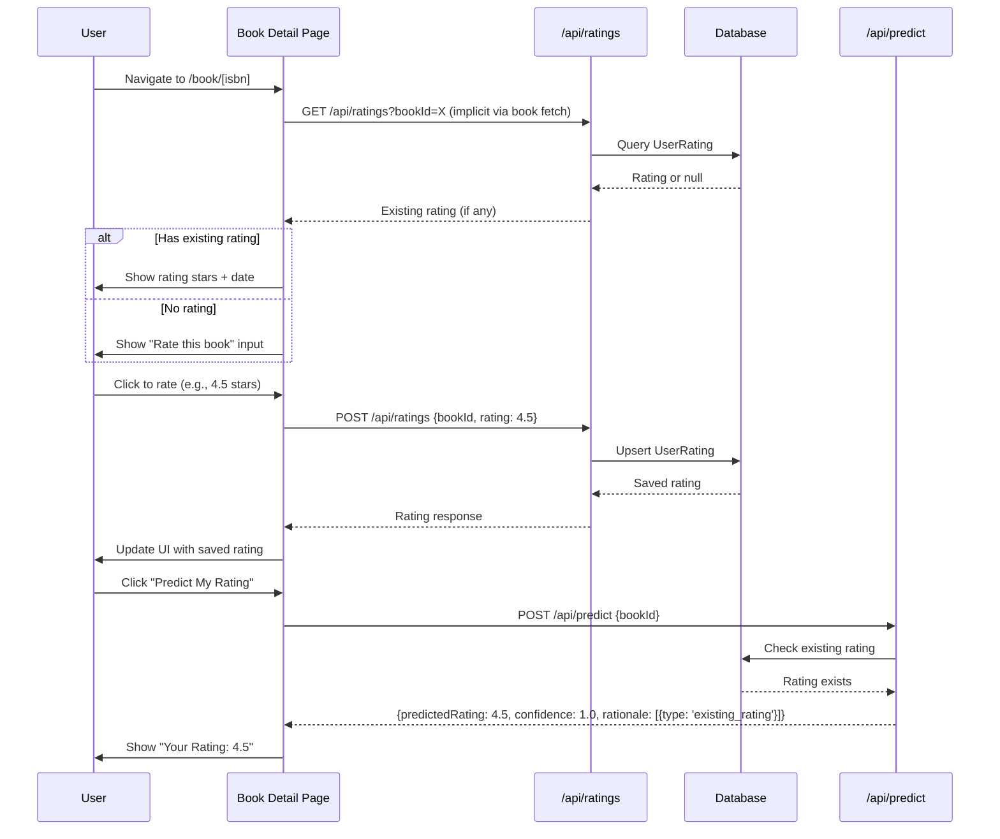
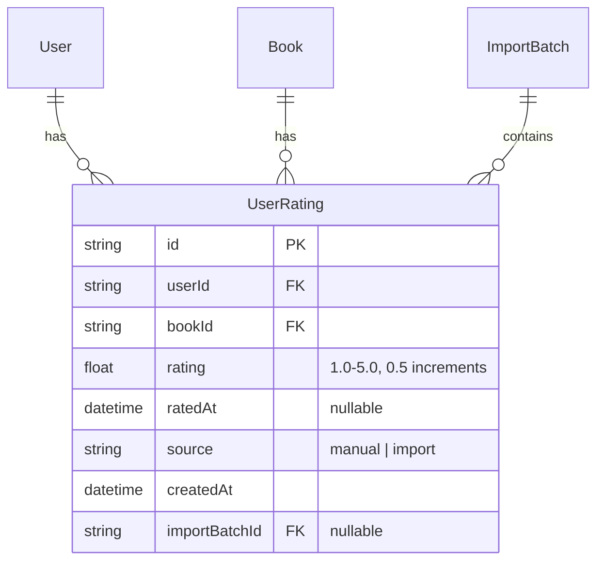

# User Ratings & Feedback Loop (Milestone 4)

## Overview

Enable users to rate books they look up, view their rating history, and feed actual ratings back into the prediction system. This completes the feedback loop where predictions can be compared against actual user experience.

## Requirements

1. Users can rate books from 1-5 stars in 0.5 increments
2. Users can view a list of all their ratings
3. Book detail page shows existing user rating with date if one exists
4. Prediction algorithm excludes the current book if user already rated it

## Current State Analysis

### What Already Exists

| Component | Location | Status |
|-----------|----------|--------|
| `UserRating` model | `prisma/schema.prisma:34-48` | Complete - has `rating`, `ratedAt`, `source` |
| Rating validation | `lib/validations.ts:19-23` | Complete - 1-5, 0.5 increments |
| Display-only stars | `components/star-rating.tsx` | Needs interactive variant |
| Existing rating check | `app/api/predict/route.ts:40-62` | Complete - returns with confidence 1.0 |
| Upsert pattern | `app/api/import/commit/route.ts:108-128` | Template for rating API |

### What Needs to Be Created

1. Interactive `RatingInput` component
2. Rating API endpoints (POST, GET list, DELETE)
3. Ratings list page at `/ratings`
4. Book detail page enhancements
5. Header navigation update

## Technical Approach

### Database

**No schema changes required.** The existing `UserRating` model supports all requirements:

```prisma
model UserRating {
  id            String       @id @default(cuid())
  userId        String
  bookId        String
  rating        Float        // Supports 0.5 increments
  ratedAt       DateTime?    // Date user rated (manual: now, import: from CSV)
  source        String?      // 'manual' | 'import'
  createdAt     DateTime     @default(now())
  // ... relations
  @@unique([userId, bookId])
}
```

**Source field values:**
- `'import'` - Rating came from CSV import
- `'manual'` - Rating entered through app UI

**Date semantics:**
- `ratedAt` - When the user rated the book (editable for imports)
- `createdAt` - When the database record was created

### API Design

#### `POST /api/ratings` - Create or Update Rating

```typescript
// Request
{ bookId: string, rating: number }

// Response (201 Created or 200 OK)
{
  rating: {
    id: string,
    bookId: string,
    rating: number,
    ratedAt: string,
    source: 'manual'
  }
}
```

#### `GET /api/ratings` - List User's Ratings

```typescript
// Query params: ?page=1&limit=20&sort=ratedAt:desc

// Response
{
  ratings: [{
    id: string,
    rating: number,
    ratedAt: string,
    source: string,
    book: {
      id: string,
      isbn13: string,
      title: string,
      authors: string[],
      coverUrl: string | null
    }
  }],
  pagination: {
    page: number,
    limit: number,
    total: number,
    totalPages: number
  }
}
```

#### `DELETE /api/ratings/[ratingId]` - Remove Rating

```typescript
// Response (204 No Content)
```

### Component Architecture

```
components/
├── star-rating.tsx          # Existing display-only (unchanged)
├── rating-input.tsx         # NEW: Interactive star selector
└── ui/
    └── confirmation-dialog.tsx  # For delete confirmation
```

#### RatingInput Component

```typescript
interface RatingInputProps {
  value: number | null
  onChange: (rating: number) => void
  disabled?: boolean
  size?: 'sm' | 'md' | 'lg'
}
```

**Half-star selection UX:**
- Desktop: Click left half of star = X.5, right half = X+1
- Mobile: Same click zones, with visual feedback on touch
- Hover preview shows potential rating before click
- Current selection highlighted with filled stars

**Accessibility:**
- Arrow keys to increment/decrement by 0.5
- Tab to focus, Enter to confirm
- ARIA: `role="slider"`, `aria-valuemin="1"`, `aria-valuemax="5"`, `aria-valuenow`
- Screen reader: "Rating: 3.5 out of 5 stars"

### Page Structure

#### Ratings List Page (`/ratings`)

```
app/
└── ratings/
    └── page.tsx    # Server component with client interactivity
```

**Features:**
- Paginated list. Defaults to 20, but allows any positive integer value <=100
- Sort by: Date rated (default), Rating, Title
- Each item shows: Cover, Title, Author, Rating stars, Date
- Click book to navigate to `/book/[isbn]`
- Delete button with confirmation

#### Book Detail Page Updates (`/book/[isbn]`)

**Current flow:**
1. Fetch book data
2. Show "Predict My Rating" button
3. Display prediction when clicked

**New flow:**
1. Fetch book data + existing user rating
2. If rated: Show rating stars + date + edit capability
3. If not rated: Show "Rate this book" input
4. "Predict My Rating" button still available
5. After rating: Prediction updates to show "Your Rating" state

### Navigation Update

Add "My Ratings" link to header navigation:

```typescript
// components/header.tsx
{ href: '/ratings', label: 'My Ratings' }
```

## Implementation Phases

### Phase 1: API Layer

**Files to create:**
- `app/api/ratings/route.ts` - POST (create/update) and GET (list)
- `app/api/ratings/[ratingId]/route.ts` - DELETE

**Validation:**
- Use existing `ratingSchema` from `lib/validations.ts`
- Validate `bookId` exists in database
- Ensure user is authenticated

### Phase 2: Interactive Rating Component

**Files to create:**
- `components/rating-input.tsx`

**Implementation details:**
- Build on existing `StarRating` for visual consistency
- Add click handlers with half-star zones
- Implement hover preview state
- Add keyboard navigation
- Include loading/saving states

### Phase 3: Book Detail Integration

**Files to modify:**
- `app/book/[isbn]/page.tsx`

**Changes:**
- Fetch user's rating for this book on load
- Add rating display section (if rated)
- Add rating input section (if not rated)
- Show "Rated on [date]" with edit capability
- Handle rating save with optimistic UI

### Phase 4: Ratings List Page

**Files to create:**
- `app/ratings/page.tsx`

**Features:**
- Fetch paginated ratings
- Display as card list with book info
- Implement sorting controls
- Add delete functionality with confirmation
- Empty state for users with no ratings

### Phase 5: Navigation & Polish

**Files to modify:**
- `components/header.tsx` - Add "My Ratings" link

**Polish:**
- Success/error toast notifications
- Loading skeletons
- Mobile responsive adjustments

## Acceptance Criteria

### Functional Requirements

- [x] User can click stars to rate a book 1-5 in 0.5 increments
- [x] Rating persists to database via API
- [x] User can update an existing rating
- [ ] User can delete a rating (with confirmation)
- [x] Book detail page shows existing rating with date
- [ ] Ratings list page displays all user ratings
- [ ] Ratings list is paginated and sortable
- [ ] Header includes "My Ratings" navigation link
- [ ] Prediction endpoint returns existing rating when book is rated

### Non-Functional Requirements

- [x] Rating input is keyboard accessible
- [x] Screen reader announces rating changes
- [ ] API responses < 200ms
- [x] Optimistic UI updates for rating changes
- [x] Mobile-friendly touch targets (44x44px minimum)

### Quality Gates

- [x] All new API routes have authentication checks
- [x] Rating validation prevents invalid values
- [ ] No N+1 queries in ratings list
- [x] TypeScript strict mode passes
- [x] ESLint passes

## Edge Cases

| Scenario | Behavior |
|----------|----------|
| Rate book not in database | Error - book must exist first |
| Rate same book twice | Upsert - updates existing rating |
| Delete imported rating | Allowed - clears `importBatchId` relationship |
| Edit imported rating | Changes `source` to `'manual'`, clears `importBatchId` |
| View book after rating | Shows "Your Rating" instead of prediction prompt |
| Request prediction for rated book | Returns existing rating with confidence 1.0 |
| Concurrent updates (two tabs) | Last write wins, no conflict resolution |

## Data Flow Diagram



## ERD Changes



*Note: No schema changes - this documents existing structure.*

## File Summary

### New Files

| File | Purpose |
|------|---------|
| `app/api/ratings/route.ts` | POST (create/update) and GET (list) ratings |
| `app/api/ratings/[ratingId]/route.ts` | DELETE rating |
| `components/rating-input.tsx` | Interactive star rating selector |
| `app/ratings/page.tsx` | User's ratings list page |

### Modified Files

| File | Changes |
|------|---------|
| `app/book/[isbn]/page.tsx` | Add rating display/input, fetch existing rating |
| `components/header.tsx` | Add "My Ratings" nav link |

## References

### Internal

- Existing rating model: [prisma/schema.prisma:34-48](prisma/schema.prisma#L34-L48)
- Rating validation: [lib/validations.ts:19-23](lib/validations.ts#L19-L23)
- Display stars component: [components/star-rating.tsx](components/star-rating.tsx)
- Prediction endpoint: [app/api/predict/route.ts](app/api/predict/route.ts)
- Upsert pattern: [app/api/import/commit/route.ts:108-128](app/api/import/commit/route.ts#L108-L128)

### Institutional Learnings

- Use kebab-case filenames to avoid case-sensitivity issues on Linux/Vercel
- Mock `server-only` in tests: `vi.mock('server-only', () => ({}))`
- Follow Neon branching pattern for any schema changes

### Project Plan

- Original M4 description: [project-plan.md](project-plan.md) - "M4: Save prediction + later record actual rating; feed back into model"
