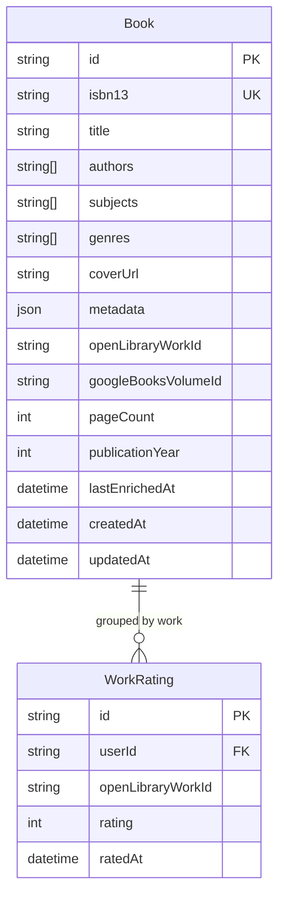

# Milestone 5.6: Google Books as Primary Data Source

## Overview

Change the canonical book data source from Open Library to Google Books to improve coverage of newer books while maintaining work-level rating integrity.

## Problem Statement

The current Open Library-first approach has limitations:

1. **Newer books not found**: Recent commercial releases often exist in Google Books but not Open Library
2. **Open Library latency**: Responses can be slow (1-2s)
3. **Community-dependent updates**: Open Library relies on community contributions, causing lag for new releases

Google Books offers better coverage for commercial releases, faster responses, and higher documented rate limits (1000/day with API key vs Open Library's undocumented limits).

## Options Analysis

### Option A: Google Books Primary, Open Library Augmentation

**How it works:**
1. ISBN lookup calls Google Books first
2. If found, also call Open Library specifically to get the work ID
3. If Google Books fails, fall back to Open Library entirely

**Pros:**
- Gets best of both worlds: GB's newer book coverage + OL's work-level linking
- Preserves existing `WorkRating` architecture
- Minimal migration impact

**Cons:**
- Two API calls for every new book (higher latency for creation)
- More complex orchestration logic

### Option B: Open Library Primary, Google Books Fallback

**How it works:**
1. ISBN lookup calls Open Library first (current behavior)
2. Only if Open Library returns nothing, call Google Books

**Pros:**
- Simplest change from current implementation
- Work IDs always available when OL has the book

**Cons:**
- Doesn't solve the core problem (newer books missing from OL)
- Books only in Google Books will have no work ID

### Option C: Fully Replace Open Library with Google Books

**How it works:**
1. Remove all Open Library calls
2. Use only Google Books for all book data
3. Generate synthetic work IDs based on normalized title + author

**Pros:**
- Simplest architecture (single data source)
- Highest rate limits
- Best coverage for newer books

**Cons:**
- **Loses work-level linking**: Google Books has NO work ID concept
- Synthetic IDs are fragile (title variations cause collisions)
- Existing `WorkRating` records become orphaned
- Different editions won't be linked reliably

## Recommendation: Option A (Google Books Primary, Open Library Augmentation)

This option achieves the stated goals while preserving the work-level rating system that M5.2 and M5.3 depend on.

**Key insight**: The `openLibraryWorkId` is essential for the prediction system. Work-level ratings ensure that rating "Dune" paperback counts the same as "Dune" hardcover. Google Books cannot provide this on its own.

## Technical Approach

### Phase 1: Enhance Google Books Client

Update [googlebooks.ts](lib/books/googlebooks.ts) to support full book creation, not just metadata enrichment.

**New function: `lookupBookByIsbn`**

```typescript
// lib/books/googlebooks.ts

export interface GoogleBooksBook {
  googleBooksVolumeId: string;
  isbn13: string | null;
  title: string;
  authors: string[];
  coverUrl: string | null;
  genres: string[];
  pageCount: number | null;
  publishedDate: string | null;
  description: string | null;
}

export async function lookupBookByIsbn(isbn: string): Promise<GoogleBooksBook | null> {
  // Use existing lookupByIsbn logic but return full book data
  // Include googleBooksVolumeId from response.items[0].id
}
```

### Phase 2: Add Work ID Lookup to Open Library

Add a lightweight function to [openlibrary.ts](lib/books/openlibrary.ts) that only fetches the work ID.

```typescript
// lib/books/openlibrary.ts

export async function lookupWorkIdByIsbn(isbn: string): Promise<string | null> {
  // Fetch /isbn/{isbn}.json
  // Extract works[0].key (e.g., "/works/OL123W")
  // Return just the work ID, not full book data
}
```

### Phase 3: Update ISBN Lookup Route

Modify [route.ts](app/api/books/isbn/[isbn]/route.ts) to implement the new source priority.

**New flow:**

```
1. Check local DB for existing book (by isbn13)
   └─ If found: lazy enrich if needed, return

2. Call Google Books API (primary)
   ├─ If found:
   │   ├─ Call Open Library for work ID (parallel)
   │   ├─ Create book with GB data + OL work ID
   │   └─ Return book
   │
   └─ If not found:
       ├─ Call Open Library as fallback (full lookup)
       ├─ If found: Create book with OL data
       └─ If not found: Return 404

3. If Open Library work ID lookup fails:
   └─ Create book with synthetic work ID
```

**Synthetic work ID generation** (for books without OL work ID):

```typescript
function generateSyntheticWorkId(title: string, author: string): string {
  // Normalize: lowercase, remove articles, standardize punctuation
  const normalizedTitle = title.toLowerCase()
    .replace(/^(the|a|an)\s+/i, '')
    .replace(/[^a-z0-9]/g, '');
  const normalizedAuthor = author.toLowerCase()
    .replace(/[^a-z0-9]/g, '');

  const hash = md5(`${normalizedTitle}:${normalizedAuthor}`).slice(0, 12);
  return `synthetic:${hash}`;
}
```

### Phase 4: Update Search (Optional)

Consider whether to also switch search to Google Books. This is **lower priority** because:
- Search is less critical than ISBN lookup for book discovery
- Open Library search returns work-level results (natural deduplication)
- Google Books search returns editions (may show duplicates)

**Recommendation**: Keep Open Library for search initially; evaluate based on user feedback.

### Phase 5: Schema Updates

Add `googleBooksVolumeId` to track the Google Books identifier.

```prisma
// prisma/schema.prisma

model Book {
  // ... existing fields
  googleBooksVolumeId String?

  @@index([googleBooksVolumeId])
}
```

**Note**: Keep `openLibraryWorkId` field name for backward compatibility. It may contain synthetic IDs for books not in Open Library.

## Acceptance Criteria

### Functional Requirements

- [ ] ISBN lookup checks Google Books first, then Open Library
- [ ] Books found in Google Books also get Open Library work ID (when available)
- [ ] Books not in Open Library receive synthetic work ID
- [ ] Existing books continue to work (no migration required for existing data)
- [ ] Rate limiting respects Google Books quota (1000/day with key)
- [ ] Graceful degradation when Google Books quota exhausted (fall back to OL)

### Non-Functional Requirements

- [ ] ISBN lookup latency < 3 seconds for new books
- [ ] All existing tests pass
- [ ] New integration tests cover: GB-only books, OL-only books, books in both, books in neither

## Data Model Changes

### ERD



## Implementation Phases

### Phase 1: Google Books Full Lookup (lib/books/googlebooks.ts)

- [x] Create `GoogleBooksBook` interface with all fields
- [x] Implement `lookupBookByIsbn()` returning full book data
- [x] Include `googleBooksVolumeId` in response
- [ ] Add tests for new function

### Phase 2: Work ID Lookup (lib/books/openlibrary.ts)

- [x] Create `lookupWorkIdByIsbn()` function (lightweight, work ID only)
- [x] Handle 404 gracefully (return null)
- [ ] Add tests for work ID lookup

### Phase 3: Synthetic Work ID Generator (lib/books/workId.ts)

- [x] Create `generateSyntheticWorkId(title, author)` function (already existed)
- [x] Implement normalization (lowercase, remove articles, etc.)
- [x] Add collision-resistant hashing
- [ ] Add tests verifying deterministic output

### Phase 4: ISBN Route Update (app/api/books/isbn/[isbn]/route.ts)

- [x] Implement new source priority (GB first, OL work ID, OL fallback)
- [x] Call OL work ID lookup in parallel with book creation
- [x] Handle quota exhaustion (fall back to OL entirely)
- [x] Use synthetic work ID when OL lookup fails
- [x] Add comprehensive error handling

### Phase 5: Schema Migration

- [x] Add `googleBooksVolumeId` field to Book model
- [x] Create and apply migration
- [x] No data migration needed (new field is optional)

### Phase 6: Integration Testing

- [ ] Test: New book in Google Books only
- [ ] Test: New book in Open Library only
- [ ] Test: New book in both (verify GB data + OL work ID)
- [ ] Test: New book in neither (404)
- [ ] Test: Google Books quota exhausted mid-session
- [ ] Test: Existing book lazy enrichment unchanged

## Edge Cases

| Scenario | Behavior |
|----------|----------|
| Book in GB only | Create with GB data + synthetic work ID |
| Book in OL only | Create with OL data + OL work ID |
| Book in both | Create with GB data + OL work ID |
| Book in neither | Return 404 |
| GB quota exhausted | Fall back to OL entirely |
| OL work ID lookup fails | Use synthetic work ID |
| OL work ID lookup times out | Use synthetic work ID, log warning |

## Risk Analysis

| Risk | Impact | Mitigation |
|------|--------|------------|
| Synthetic IDs cause rating fragmentation | High | Normalize aggressively; document that some edge cases may create duplicates |
| Google Books rate limit hit frequently | Medium | Monitor quota usage; implement circuit breaker |
| Increased latency for new books | Medium | Parallelize OL work ID lookup; cache aggressively |
| Google Books API deprecation | Low | Keep OL fallback; maintain ability to switch back |

## Success Metrics

1. **Coverage improvement**: Track % of ISBN lookups that succeed (target: >95%, up from current ~85%)
2. **Work ID availability**: Track % of books with non-synthetic work IDs (target: >80%)
3. **Latency**: P95 ISBN lookup latency < 3s for new books
4. **Quota usage**: Stay under 80% of daily Google Books quota

## References

### Internal References

- Current Open Library client: [openlibrary.ts](lib/books/openlibrary.ts)
- Current Google Books client: [googlebooks.ts](lib/books/googlebooks.ts)
- ISBN lookup route: [route.ts](app/api/books/isbn/[isbn]/route.ts)
- Enrichment orchestration: [enrichment.ts](lib/books/enrichment.ts)
- Existing plan document: [2026-02-17-m5-improved-metadata-canonical-works-plan.md](docs/plans/2026-02-17-m5-improved-metadata-canonical-works-plan.md)

### External References

- [Google Books API Documentation](https://developers.google.com/books/docs/v1/using)
- [Google Books Volume Resource](https://developers.google.com/books/docs/v1/reference/volumes)
- [Open Library Books API](https://openlibrary.org/dev/docs/api/books)
- [Open Library FRBRization (Work concept)](https://openlibrary.org/about/frbrization)

### Related Work

- M5.2: Work-level ratings (depends on `openLibraryWorkId`)
- M5.3: Work-level predictions
- M5.5: Google Books enrichment (already implemented)
