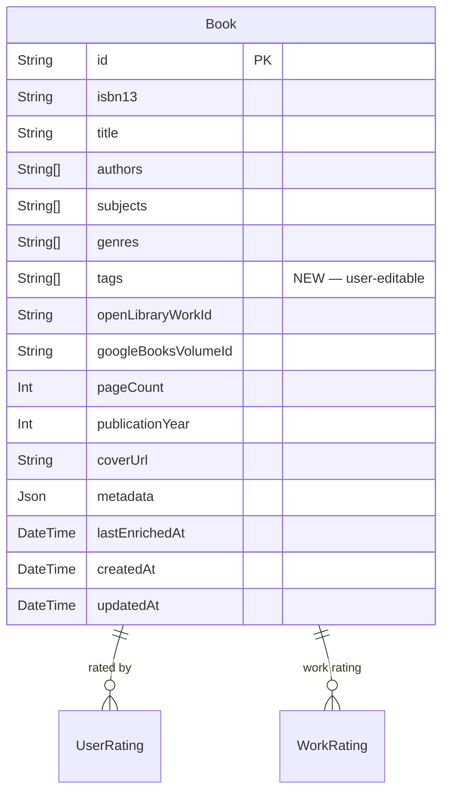

# M7: User Tags for Work-Level Metadata

## Overview

External metadata sources (Open Library subjects, Google Books genres) frequently provide low-quality or missing data, degrading prediction accuracy. M7 introduces **user-defined tags** — a free-form, comma-delimited annotation layer that any authenticated user can add, edit, or remove on any book. Tags are stored at the work level and fed into the TF-IDF prediction engine alongside `subjects` and `genres`.

This milestone directly addresses the root cause of prediction gaps when automated enrichment falls short.

---

## Problem Statement

The prediction engine in M2 relies on text similarity across `subjects`, `genres`, `title`, `authors`, and bucketed metadata (page count, publication era). For books with thin or inaccurate enrichment — particularly niche, self-published, or older titles — the similarity corpus is too sparse to produce confident predictions.

Users have domain knowledge about books that no API captures cleanly: pacing ("slow burn"), emotional tone ("cozy", "bleak"), narrative style ("unreliable narrator"), tropes ("chosen one", "magic school"), and reading experience ("comfort read", "hard to put down"). This signal is high-value and the app currently has no way to capture it.

---

## Proposed Solution

Add a `tags String[]` column to the `Book` model. Tags are:
- **Editable by any authenticated user** on the book detail page
- **Stored at the work level** — when a book has an `openLibraryWorkId`, the tag write propagates to all `Book` rows sharing that work ID
- **Normalized** before storage: trimmed, lowercased, deduplicated, empty strings discarded
- **Fed into prediction** at 1× weight via `bookToText()`, alongside subjects (1×) and genres (2×)

The UI follows the existing inline-edit pattern from the rating widget: badges in display mode → pencil icon → comma-separated text input → Save / Cancel.

---

## Technical Approach

### Architecture

```
Book Detail Page (Client Component)
  └─ TagsSection (new component)
       ├─ Display: Badge[] chips per tag
       └─ Edit: Input (comma-delimited) + Save/Cancel
             └─ PATCH /api/books/[bookId] { tags: string[] }
                   └─ Zod validation → prisma.book.updateMany (by workId) → 200

Prediction Pipeline:
  POST /api/predict
    └─ db.book.findUnique { select: { ...existing, tags } }
    └─ BookDocument { ...existing, tags: string[] }
    └─ bookToText({ ...existing, tags }) → appends tags at 1× weight
```

### Key Design Decisions

| Decision | Choice | Rationale |
|---|---|---|
| Storage location | `tags String[]` on `Book` | Consistent with `subjects` and `genres`; no new table |
| Work-level propagation | `updateMany` across same `openLibraryWorkId` | Honors the spec's intent without a Work table |
| Authorization | Any authenticated user, last-write-wins | Matches current enrichment-refresh behavior |
| Normalization | Trim + lowercase + deduplicate | Prevents "Slow Burn" / "slow burn" duplicates in UI and vector |
| Tag weight in prediction | 1× (append once to text string) | Same as `subjects`; lower than `genres` (2×) to avoid tag-stuffing dominance |
| Edit UX | Comma-delimited text `Input` | Consistent with existing rating inline-edit pattern |
| Prediction invalidation | Clear displayed prediction on tag save | Consistent with rating-save behavior (line 181-183 of book page) |
| Enrichment refresh | Never touches `tags` | Tags are user-generated; must survive API re-enrichment |

---

## Implementation Phases

### Phase 1: Schema + Migration

**Goal:** Add `tags` to the database.

#### Tasks

- [x] Edit `prisma/schema.prisma` — add `tags String[] @default([])` to `Book` model, after `genres`
- [x] Run `pnpm db:migrate:dev --name add-book-tags`
- [x] Review generated SQL in `prisma/migrations/<timestamp>_add-book-tags/migration.sql`
- [x] Commit `schema.prisma` + migration folder

#### Schema Change

```prisma
// prisma/schema.prisma — Book model
model Book {
  // ...existing fields...
  genres              String[]     @default([])
  tags                String[]     @default([])   // ← new
  // ...
}
```

#### Success Criteria

- Migration applies cleanly against dev Neon branch
- `db.book.findUnique` can select `tags` and returns `[]` for existing books

---

### Phase 2: Validation Schema

**Goal:** Define shared tag validation rules used by both API route and client.

#### Tasks

- [x] Add `tagsSchema` to `lib/validations.ts`

#### Validation Rules

```typescript
// lib/validations.ts
export const tagsSchema = z
  .array(
    z.string()
      .trim()
      .toLowerCase()
      .min(1, 'Tag must not be empty')
      .max(100, 'Tag must be 100 characters or fewer')
  )
  .max(50, 'Maximum 50 tags per book')
  .transform((tags) => [...new Set(tags.filter((t) => t.length > 0))]);
```

Note: `toLowerCase()` is a Zod transform, not a native method — the transform normalizes casing. Deduplication via `Set` happens after trim + filter.

#### Parsing helper (client-side, inline in component)

```typescript
// Parse comma-delimited input string into normalized tag array
function parseTags(input: string): string[] {
  return input
    .split(',')
    .map((t) => t.trim().toLowerCase())
    .filter((t) => t.length > 0);
}
```

---

### Phase 3: API — PATCH Endpoint

**Goal:** Expose a write endpoint for tags, applying work-level propagation.

#### Tasks

- [x] Add `PATCH` handler to `app/api/books/[bookId]/route.ts`
- [x] Update `GET` handler in same file to include `tags` in response (if not already returning the full book record)
- [x] Ensure `GET /api/books/isbn/[isbn]/route.ts` returns `tags` (audit response shape)

#### PATCH Handler Sketch

```typescript
// app/api/books/[bookId]/route.ts
export async function PATCH(req: Request, { params }: { params: { bookId: string } }) {
  const session = await getServerSession(authOptions);
  if (!session) return NextResponse.json({ error: 'Unauthorized' }, { status: 401 });

  const body = await req.json();
  const result = z.object({ tags: tagsSchema }).safeParse(body);
  if (!result.success) return NextResponse.json({ error: result.error.flatten() }, { status: 400 });

  const book = await db.book.findUnique({ where: { id: params.bookId }, select: { openLibraryWorkId: true } });
  if (!book) return NextResponse.json({ error: 'Not found' }, { status: 404 });

  // Work-level propagation: update all editions sharing the same work ID
  if (book.openLibraryWorkId) {
    await db.book.updateMany({
      where: { openLibraryWorkId: book.openLibraryWorkId },
      data: { tags: result.data.tags },
    });
  } else {
    await db.book.update({ where: { id: params.bookId }, data: { tags: result.data.tags } });
  }

  return NextResponse.json({ tags: result.data.tags });
}
```

#### Success Criteria

- `PATCH /api/books/:id { tags: ["slow burn", "cozy"] }` returns `{ tags: ["slow burn", "cozy"] }`
- Tags propagate to sibling editions sharing `openLibraryWorkId`
- Unauthenticated requests return 401
- Invalid payloads (tag > 100 chars, > 50 tags) return 400

---

### Phase 4: Prediction Pipeline Integration

**Goal:** Include tags in TF-IDF similarity computation.

Four files must be updated in lockstep:

#### 4a. `lib/prediction/tfidf.ts`

Add `tags: string[]` to `BookDocument` interface (line ~8):

```typescript
export interface BookDocument {
  id: string;
  title: string;
  authors: string[];
  subjects: string[];
  genres: string[];
  tags: string[];           // ← new
  pageCount: number | null;
  publicationYear: number | null;
}
```

#### 4b. `lib/prediction/predictor.ts`

Add `tags: string[]` to `RatedBook` interface (line ~34):

```typescript
export interface RatedBook {
  // ...existing fields...
  tags: string[];           // ← new
}
```

#### 4c. `lib/prediction/tokenizer.ts`

Add `tags` parameter to `bookToText()` (line ~83) and append at 1× weight:

```typescript
export function bookToText(book: {
  title: string;
  authors: string[];
  subjects: string[];
  genres: string[];
  tags: string[];           // ← new
  pageCount: number | null;
  publicationYear: number | null;
}): string {
  const tagText = book.tags.join(' ');
  // Weight: title 2×, genres 2×, subjects 1×, authors 1×, tags 1×, buckets 1×
  return `${titleText} ${titleText} ${authorText} ${subjectText} ${genreText} ${genreText} ${tagText} ${lengthBucket} ${eraBucket}`;
}
```

#### 4d. `app/api/predict/route.ts`

Add `tags` to both `select` blocks (target book ~line 32, rated books corpus ~line 87):

```typescript
// Target book select
const book = await db.book.findUnique({
  where: { id: bookId },
  select: {
    id, title, authors, subjects, genres,
    tags,              // ← new
    pageCount, publicationYear,
  },
});

// Rated books corpus select (inside WorkRating join or equivalent)
// Add tags to whichever select fetches the rated books for similarity
```

And update both `BookDocument` / `RatedBook` build objects to include `tags: book.tags`.

#### Success Criteria

- Calling `POST /api/predict` for a book with tags produces a different similarity score than without tags
- `matchingTerms` in rationale can surface tag-derived tokens (e.g., if both books are tagged "slow burn", tokens "slow" and "burn" appear as matches)
- Tags on books with no subjects/genres are sufficient for a non-null prediction

---

### Phase 5: UI — Tags Section on Book Detail Page

**Goal:** Inline-editable tags section on `app/book/[isbn]/page.tsx`.

#### Tasks

- [x] Add `tags?: string[]` to the `ApiBook` interface in the page file
- [x] Create `TagsSection` component (inline or extracted to `components/tags-section.tsx`)
- [x] Place section after the enrichment collapsible, before the rating section
- [x] Wire `PATCH /api/books/[bookId]` on save
- [x] Clear prediction display after successful tag save (mirror line 181-183)

#### Component Sketch

```tsx
// components/tags-section.tsx
'use client';

function TagsSection({ bookId, initialTags }: { bookId: string; initialTags: string[] }) {
  const [tags, setTags] = useState(initialTags);
  const [editing, setEditing] = useState(false);
  const [inputValue, setInputValue] = useState('');

  const handleEdit = () => {
    setInputValue(tags.join(', '));
    setEditing(true);
  };

  const handleSave = async () => {
    const parsed = parseTags(inputValue);
    const res = await fetch(`/api/books/${bookId}`, {
      method: 'PATCH',
      headers: { 'Content-Type': 'application/json' },
      body: JSON.stringify({ tags: parsed }),
    });
    if (res.ok) {
      const { tags: saved } = await res.json();
      setTags(saved);
      setEditing(false);
      // caller should also clear prediction display
    }
  };

  return (
    <section>
      <div className="flex items-center justify-between">
        <h3><Tag className="inline h-4 w-4" /> Tags</h3>
        {!editing && (
          <Button variant="ghost" size="sm" onClick={handleEdit}>
            <Pencil className="h-4 w-4" />
          </Button>
        )}
      </div>

      {editing ? (
        <div className="space-y-2">
          <Input
            value={inputValue}
            onChange={(e) => setInputValue(e.target.value)}
            placeholder="slow burn, coming of age, unreliable narrator"
          />
          <div className="flex gap-2">
            <Button size="sm" onClick={handleSave}>Save</Button>
            <Button size="sm" variant="ghost" onClick={() => setEditing(false)}>Cancel</Button>
          </div>
        </div>
      ) : tags.length > 0 ? (
        <div className="flex flex-wrap gap-1 mt-1">
          {tags.map((tag) => (
            <Badge key={tag} variant="outline" className="text-xs font-normal">
              {tag}
            </Badge>
          ))}
        </div>
      ) : (
        <p className="text-sm text-muted-foreground">No tags yet — click edit to add some.</p>
      )}
    </section>
  );
}
```

#### Visual Design Notes

- Tags use `variant="outline"` badges (vs `variant="secondary"` for subjects/genres) to visually distinguish user-generated data
- `Tag` lucide icon (already imported in the page at line 27) used as section header icon
- Edit triggered by `Pencil` icon button (same as rating section)
- Empty state shows a prompt so the feature is discoverable

#### Success Criteria

- Tags render as badge chips on the book detail page
- Edit mode opens with current tags pre-populated as comma-separated string
- Save normalizes input (trim, lowercase, deduplicate) and persists via PATCH
- Cancel returns to display mode with no changes
- Prediction display clears after a successful save (same as rating save)
- Empty tags array shows "No tags yet" placeholder, not a hidden section

---

## Alternative Approaches Considered

### Per-User Tags (Rejected)
Store tags per-user per-book (like ratings). Rejected because:
- Tags are intended as shared community knowledge, not individual opinion
- Per-user tags would require aggregating across users before feeding prediction, adding complexity
- The spec explicitly states "any user can add, modify, or remove tags"

### Separate `Work` Table (Deferred)
A true `Work` entity with a `tags` column would cleanly model the work-level intent. Deferred because:
- Creating a Work table is a significant schema migration affecting the entire data model
- The `openLibraryWorkId`-based `updateMany` achieves the same result for the current data volume
- A Work table is a reasonable future refactor if M8+ requirements demand it

### Tag Chip / Pill Input (Mobile-Friendly, Deferred)
A chip-based input (press Enter or comma to add individual tags, backspace to remove) is more mobile-friendly than free-text comma-delimited entry. Deferred because:
- No off-the-shelf chip input exists in the current shadcn/ui primitive set
- Building a custom chip component adds scope to what is otherwise a simple CRUD feature
- The comma-delimited pattern is sufficient for the current user base

---

## Acceptance Criteria

### Functional

- [x] Tags field `tags String[] @default([])` exists on `Book` model; migration applies cleanly
- [x] `PATCH /api/books/[bookId] { tags: [...] }` persists tags and propagates to all editions sharing the same `openLibraryWorkId`
- [x] Unauthenticated `PATCH` returns 401
- [x] Invalid payloads (> 50 tags, tag > 100 chars) return 400
- [x] Tags are trimmed, lowercased, and deduplicated before storage
- [x] Tags survive an enrichment refresh (re-fetch from Open Library / Google Books does not overwrite tags)

### Prediction

- [x] `BookDocument` and `RatedBook` interfaces include `tags: string[]`
- [x] `bookToText()` appends tag text at 1× weight
- [x] `POST /api/predict` fetches `tags` for both the target book and all rated books in the corpus
- [x] A book with only user tags (no subjects, no genres) produces a non-null similarity score against a similarly tagged rated book

### UI

- [x] Tags section is visible on the book detail page (not collapsed)
- [x] Empty state shows placeholder text, not an empty section
- [x] Edit mode opens with current tags pre-filled as comma-separated string
- [x] Save button normalizes input and persists; display updates immediately
- [x] Cancel restores previous state with no API call
- [x] Prediction result is cleared after a successful tag save
- [x] Tags display with `variant="outline"` badges, visually distinct from subjects/genres

### Edge Cases

- [x] Saving an empty input string clears all tags (sets `tags: []`)
- [x] Tags containing spaces (e.g., "coming of age") are stored and displayed correctly
- [x] Leading/trailing whitespace around tags is stripped
- [x] Duplicate tags in input are deduplicated silently

---

## Known Limitations (Deferred to Future Milestones)

- **No audit trail:** Last-write-wins with no history. If a user corrupts a book's tags, there is no rollback. Consider a `TagEdit` audit log in a future milestone.
- **No conflict detection:** Two users editing simultaneously will silently overwrite each other. Optimistic locking would require a `tagsUpdatedAt` version field.
- **Mobile UX:** Comma entry is awkward on touch keyboards. A chip-based input should be revisited if mobile usage increases post-M3.
- **No tag suggestions:** The system does not suggest tags from existing subjects, genres, or a tag vocabulary. Auto-complete or "common tags" suggestions are future scope.
- **Stop word loss:** Tags shorter than 2 characters (e.g., "YA") or composed entirely of stop words will not contribute to TF-IDF vectors. Users should be informed, or the tokenizer should be made tag-aware.

---

## Dependencies & Prerequisites

- M5 complete (Google Books integration, enrichment pipeline finalized) — ensures `genres` and `subjects` field patterns are stable before adding `tags` alongside them
- No new packages required

---

## Risk Analysis

| Risk | Likelihood | Impact | Mitigation |
|---|---|---|---|
| Tag vandalism (shared write model) | Low (small user base) | Medium (affects all users' predictions) | Auth requirement + future audit log |
| `updateMany` performance across editions | Very Low (small DB) | Low | Index on `openLibraryWorkId` already exists |
| Stop-word loss degrading tag signal | Medium | Low | Document limitation; tag 2+ meaningful tokens |
| Prediction score instability after tagging | Low | Medium | New tags shift similarity; expected and desirable behavior |

---

## Files to Change

| File | Change |
|---|---|
| `prisma/schema.prisma` | Add `tags String[] @default([])` to `Book` |
| `prisma/migrations/*/migration.sql` | Auto-generated; review before commit |
| `lib/validations.ts` | Add `tagsSchema` |
| `app/api/books/[bookId]/route.ts` | Add `PATCH` handler; ensure `GET` returns `tags` |
| `app/api/books/isbn/[isbn]/route.ts` | Ensure response includes `tags` |
| `lib/prediction/tfidf.ts` | Add `tags: string[]` to `BookDocument` |
| `lib/prediction/predictor.ts` | Add `tags: string[]` to `RatedBook` |
| `lib/prediction/tokenizer.ts` | Add `tags` param to `bookToText()`; append at 1× |
| `app/api/predict/route.ts` | Add `tags` to both `select` blocks and document builds |
| `app/book/[isbn]/page.tsx` | Add `tags` to `ApiBook`; add `TagsSection` component; clear prediction on tag save |

---

## ERD — Schema Impact



Work-level tag propagation: `updateMany WHERE openLibraryWorkId = X` (no new table; shown as a query pattern, not a schema entity).

---

## References

### Internal

- Prediction pipeline entry: [app/api/predict/route.ts](../../app/api/predict/route.ts)
- TF-IDF document type: [lib/prediction/tfidf.ts](../../lib/prediction/tfidf.ts)
- Text vectorizer: [lib/prediction/tokenizer.ts](../../lib/prediction/tokenizer.ts)
- Rated book type: [lib/prediction/predictor.ts](../../lib/prediction/predictor.ts)
- Book detail page: [app/book/[isbn]/page.tsx](../../app/book/%5Bisbn%5D/page.tsx)
- Book update route: [app/api/books/[bookId]/route.ts](../../app/api/books/%5BbookId%5D/route.ts)
- Enrichment pipeline: [lib/books/enrichment.ts](../../lib/books/enrichment.ts) (tags must be excluded from enrichment resets)
- Existing validations: [lib/validations.ts](../../lib/validations.ts)
- Subject enrichment learning: [docs/solutions/api-integrations/open-library-subject-enrichment.md](../solutions/api-integrations/open-library-subject-enrichment.md)

### Project Plan Context

From `docs/plans/project-plan.md`, M7 was originally scoped as: *"Facet annotation UI (tags, mood, pace, etc.)"* This plan implements the tags dimension. Mood and pace facets are deferred to a future M7.x or M8.
